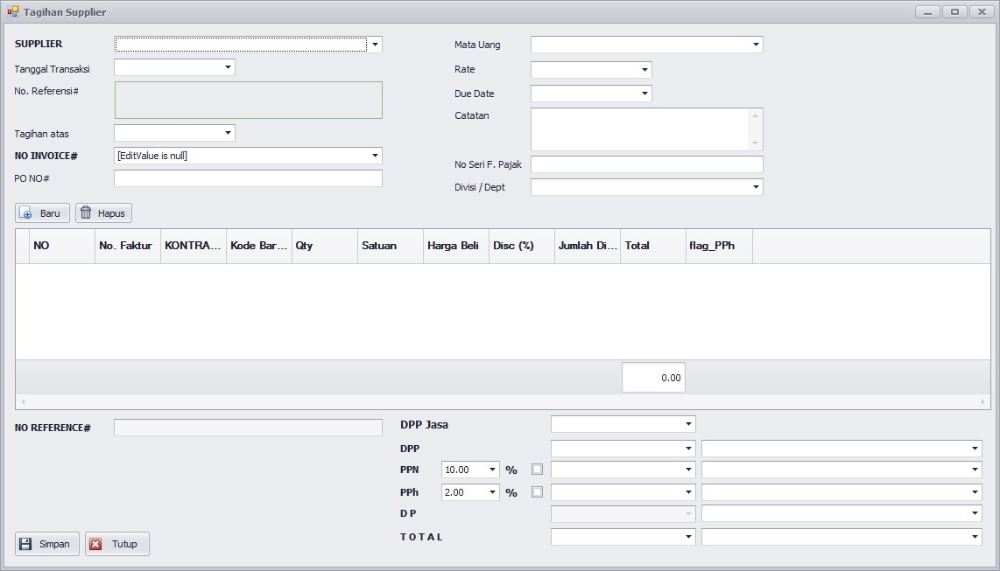

# 📅 Data Master

Pengisian data master harus diisi secara teratur agar didapatkan hasil yang optimal. Adapun urutan pengisian data master adalah sebagai berikut :

1. [DEPARTEMENT](data-master.md#data-department)
2. [DAFTAR MATA UANG](data-master.md#data-mata-uang)
3. [HEADER COA](data-master.md#header-code-subheaader-code-dan-group-code)
4. [SUB HEADER COA](data-master.md#header-code-subheaader-code-dan-group-code)
5. [GROUP COA](data-master.md#header-code-subheaader-code-dan-group-code)
6. [CHART OF ACCOUNT](data-master.md#chart-of-account)
7. [EDIT SALDO AWAL](data-master.md#edit-saldo-awal)
8. [KURS MATA UANG](data-master.md#kurs-mata-uang)

Pembahasan secara detail pada pengentrian data master akan difokuskan pada pengisian data Chart Of Account, sedangkan yang lain hanya akan dibahas sekilas mengenai fungsi dari data tersebut.

***

## Data Department

Data ini digunakan untuk mengelompokkan laporan keuangan pada tingkat cabang/departement/proyek.

<figure><figcaption>
Tampilan data department
</figcaption></figure>

***

## Data Mata Uang

Transaksi akuntansi terkadang menggunakan  beberapa mata uang, daftar mata uang ini berisi data mata uang yang digunakan untuk transaksi pada journal.

<figure><figcaption>
Tampilan data mata uang
</figcaption></figure>

***

## Header Code, Subheaader Code, dan Group Code

Sebagai level dari nomor account, diberikan 3 tingkatan header dan 2 tingkatan account.

1. Header COA

<figure><figcaption></figcaption></figure>

2. Sub Header COA

<figure><figcaption></figcaption></figure>

3. Group COA

<figure><figcaption></figcaption></figure>

***

## Chart of Account

Penggolongan pos-pos transaksi membutuhkan nomor account yang disusun secara teratur. Pada Eg Accounting diberikan kebebasan untuk membuat account dengan 5 tingkatan yaitu :

* Header
* Sub Header
* Group Header
* Account
* Sub-Code

Berikut gambar dan cara menginput Chart Of Account

<figure><figcaption>
Tampilan pada list COA
</figcaption></figure>

**GENERAL**

|               |                                                                                                                                                                                                                              |
| ------------- | ---------------------------------------------------------------------------------------------------------------------------------------------------------------------------------------------------------------------------- |
| Header Code   | Isikan dengan kode header account                                                                                                                                                                                            |
| SH. Code      | Isikan dengan kode sub header account                                                                                                                                                                                        |
| Group Code    | Isikan dengan kode group. Jika account tidak mempunyai group, maka isikan dengan kode ‘NULL’                                                                                                                                 |
| Account       | Nomor account                                                                                                                                                                                                                |
| Uraian        | Deskripsi dari nomor account                                                                                                                                                                                                 |
| Source Report | Pada combo terdapat data dari source report, anda dapat memilih salah satu dari list yang sudah ada. Source report mempunyai fungsi dimana nantinya Account akan ditampilkan dalam laporan apakah Neraca, Rugi Laba atau HPP |
| Mata Uang     | Mata uang yang digunakan account pada transaksi                                                                                                                                                                              |
| Rate          | 
Nilai tukar dari mata uang, jika IDR masukkan nilai

1 pada rate
                                                                                                                                                 |
| Saldo Awal    | Masukkan saldo awal pada nomor account sebelum terjadinya transaksi journal                                                                                                                                                  |
| Normal Trans  | Setiap account mempunyai kondisi transaksi apakah transaksi DEBET, Transaksi CREDIT                                                                                                                                          |


Transaksi DEBET biasanya digunakan untuk transaksi expense. Transaksi CREDIT biasanya digunakan untuk transaksi hutang,modal dan Pendapatan


Setelah disimpan data COA tersebut, baru kita dapat mengisi Sub-Code untuk setiap Account adapun cara penginputannya adalah sebagai berikut:

**SUBCODE**

Masuk menu Chart Of Account, kemudian klik tab ‘Sub Code’ maka akan tampil seperti gambar diatas. Pada grid sub code secara otomatis akan terisi satu record dengan sub code ‘NULL’ yang tidak dapat diedit. Sedangkan penginputan untuk sub code lain sama dengan cara pengisian data master pada umumnya. Untuk pengisian sub code tidak boleh ada spasi.

<figure><figcaption>
Tampilan subcode
</figcaption></figure>

***

## Edit Saldo Awal

Tabel Edit Saldo Awal adalah tabel untuk mendapatkan saldo awal yang dihasilkan setelah proses tutup tahun terjadi

<figure><figcaption>
Tampilan pada saldo awal
</figcaption></figure>

***

## Kurs Mata Uang

<figure><figcaption>
Tampilan pada kurs mata uang
</figcaption></figure>

***

## Tagihan Supplier

Tagihan supplier berfungsi untuk melakukan kegiatan pencatatan hutang atau pengakuan hutang

<figure><figcaption>
Tampilan pada list tagihan supplier
</figcaption></figure>

<figure><figcaption>
Tampilan pada form tagihan supplier
</figcaption></figure>

