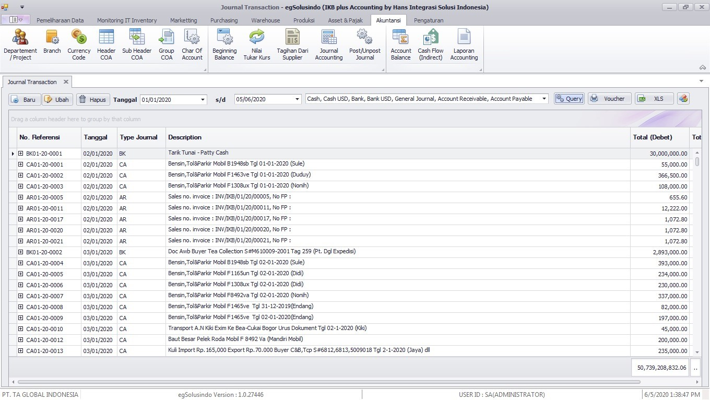
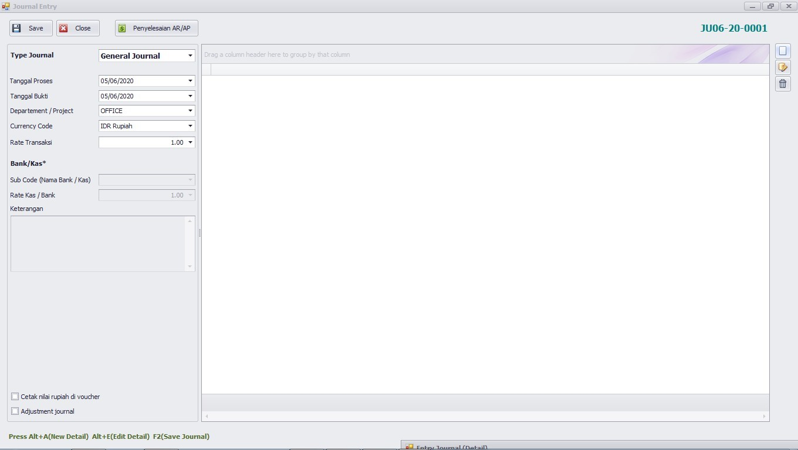
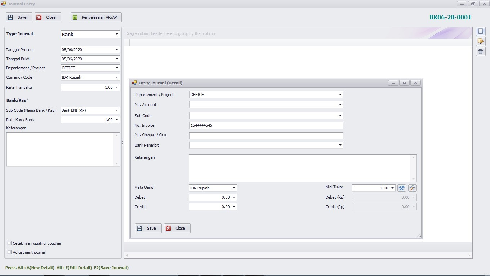
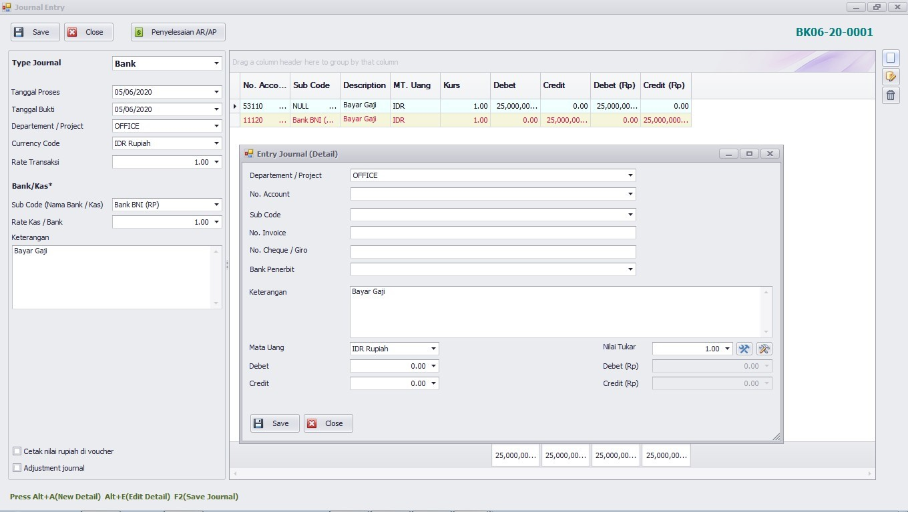
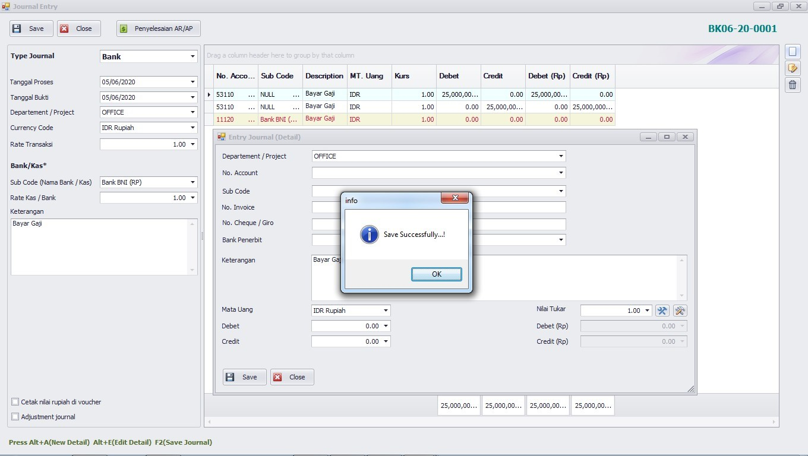

# General/Cash/Bank Journal Transaction

Secara umum penggunaan dari journal ini untuk setiap modul adalah sama namun yang membedakannya hanya ketika data disimpan dalam database.

* **General Journal** digunakan untuk transaksi – transaksi yang tidak mengunakan cash maupun bank. Dengan kata lain dalam journal tersebut tidak ada pembayaran maupun penerimaan uang.
* **Cash Journal** digunakan untuk transaksi yang melibatkan penggunaan uang cash.
* **Bank Journal** digunakan untuk transaksi yang melibatkan penggunaan uang bank.

<figure><figcaption>
Tampilan list journal
</figcaption></figure>

<figure><figcaption>
Tampilan form journal
</figcaption></figure>

<table><thead><tr><th></th><th></th><th data-hidden></th></tr></thead><tbody><tr><td>No. Referensi</td><td>Nomor bukti / voucher</td><td></td></tr><tr><td>Tanggal Proses</td><td>Tanggal dimasukkan dalam journal</td><td></td></tr><tr><td>Tanggal Bukti</td><td>Tanggal Bukti voucher sebagai referensi transaksi</td><td></td></tr></tbody></table>

Untuk menginput data detail user harus menambah data data detail, sehingga akan tampil layar sebagai berikut :

<figure><figcaption>
Tampilan input detail journal
</figcaption></figure>

|              |                                         |
| ------------ | --------------------------------------- |
| Departement  | Isi dengan kode departement             |
| Sub Code     | Sub code yang digunakan pada transaksi  |
| No. Account  | Nomor account                           |
| Uraian       | Keterangan dari transaksi               |
| Mata Uang    | Mata uang yang digunakan                |
| Nilai Tukar  | Nilai tukar pada saat terjadi transaksi |
| Debit,Credit | Jumlah nilai transaksi                  |


&#x20;Untuk pengisian transaksi Cash maupun Bank Journal maka user hanya perlu menginput  journal  lawan  dari  bank  maupun  kas.  Sedangkan  untuk  General Journal, user wajib menginput journal debet maupun kreditnya.


Contoh kasus:

1. Transaksi Cash atau Bank Journal

<figure><figcaption></figcaption></figure>

Kemudian klik tombol simpan, setelah itu akan tampil layar sbb

<figure><figcaption></figcaption></figure>

Tekan tombol F2 untuk menyimpan transaksi maka layar selanjutnya
