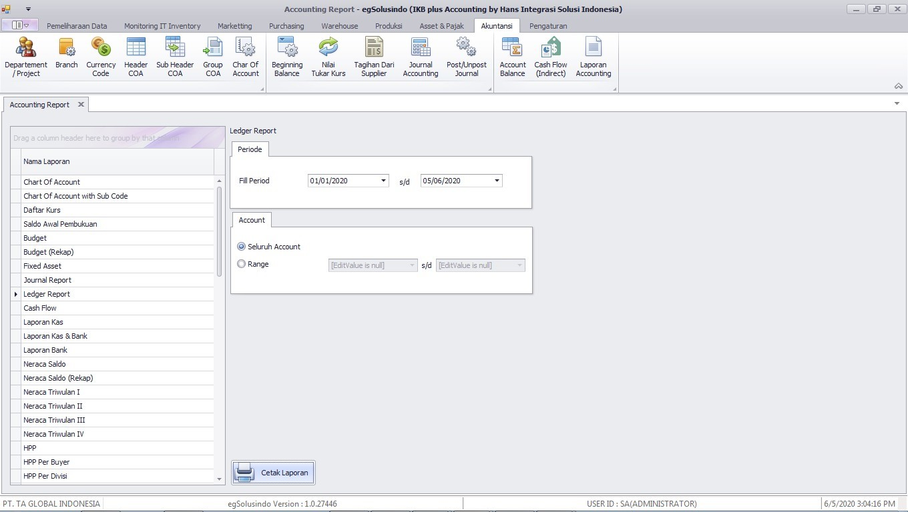

# Lain-Lain

Setelah posting selesai, maka anda dapat mencetak seluruh laporan yang tersedia pada program ini seperti chart of account, joural report, Ledger Report, Laporan Bank, Laporan Kas, Cash Flow, Budget, Trial Balance, neraca saldo, HPP, Income Statement, Balance Sheet dll.

<figure><figcaption></figcaption></figure>

* Laporan Chart of Account
* Laporan Journal
* Laporan Ledger (Buku Besar)
* Laporan Bank
* Laporan Kas
* Laporan Cash Flow
* Laporan Budget
* Laporan Trial Balance
* Laporan Neraca Saldo
* Laporan HPP
* Laporan Income Statement
* Laporan Balance Sheet
* Laporan Neraca Saldo Rekap
* Laporan HPP Rekap
* Laporan Income Statement Rekap
* dll

<figure><figcaption>
Contoh laporan ledger (buku besar)
</figcaption></figure>
