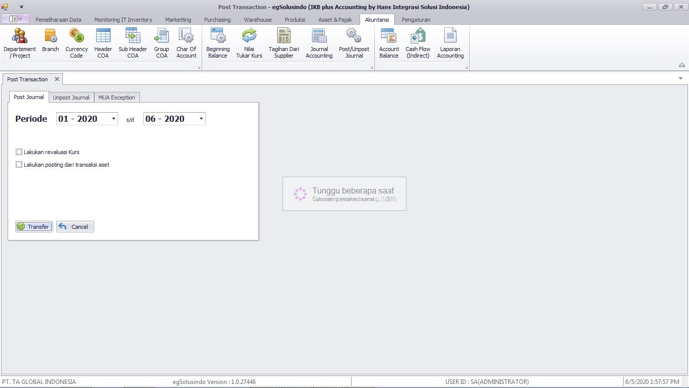
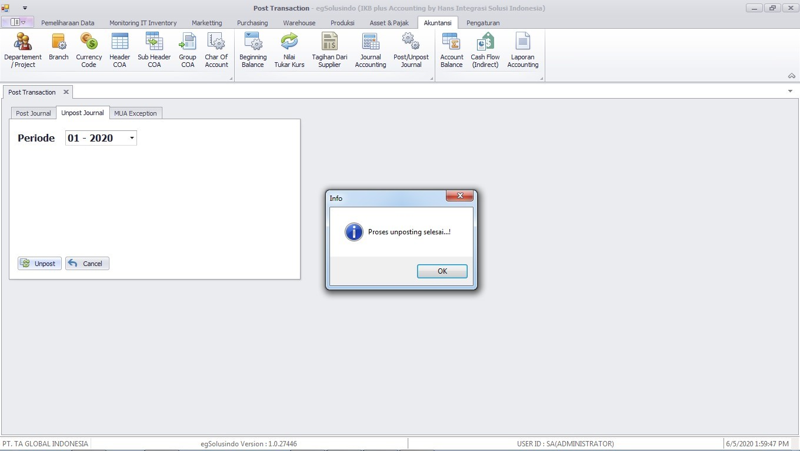

# Posting/Unposting

## Posting

Setelah transaksi journal selesai, transaksi tersebut perlu diposting untuk mendapatkan laporan-laporan akuntansi.

<figure><figcaption>
Proses posting journal
</figcaption></figure>

Masukkan range period posting dengan cara mengklik tombol maka tampil table seperti dibawah ini.

Pilih periode yang akan diposting, setelah itu klik tombol posting untuk proses atau keluar untuk membatalkan proses posting.

***

## Unposting

Unposting digunakan jika ada journal yang salah kemudian ingin mendedit data tersebut namun transaksi sudah di posting. Maka untuk memanggil kembali data tersebut unposting sangatlah diperlukan.

<figure><figcaption>
Proses unposting journal
</figcaption></figure>

Masukkan periode awal yang akan di unposting, maka seluruh data journal pada awal periode yang dimasukkan sampai yang terakhir akan terunposting secara otomatis.
