# 📦 Alur Pengisian Inventory

## Cara Pertama Menggunakan Aplikasi Inventory

### 1. Masuk ke menu Marketing

**Create Style**

<figure>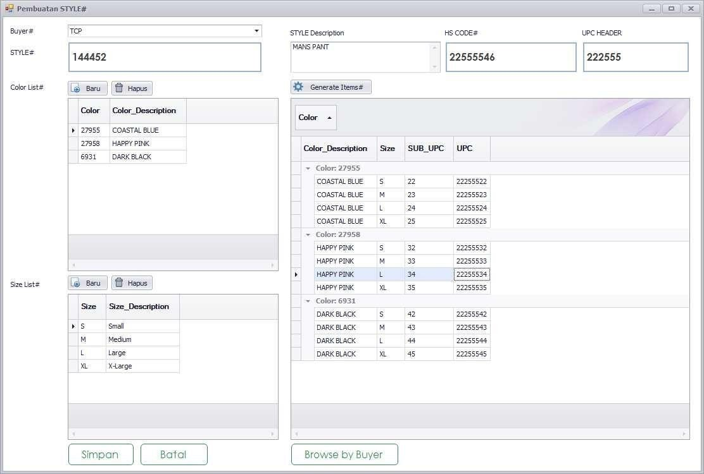<figcaption>
Contoh pengisian style
</figcaption></figure>

Isi semua data yang ada di form **pembuatan style** :

1. Pilih Buyer
2. Isi Style Code&#x20;
3. Style Diskripsi&#x20;
4. Hs Code
5. Upc Header
6. Pilih baru untuk mengisi Color List&#x20;
7. Pilih baru untuk mengisi Size List
8. Baru lakukan Generate Item dan isi datanya&#x20;
9. Simpan dan Close

**Isi Baru Order Form**

<figure>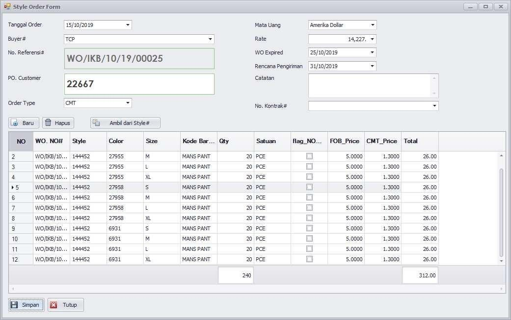<figcaption>
Contoh pengisian order form/work order
</figcaption></figure>

Isi semua data yang ada di form **pembuatan Order** :

1. Pilih Tanggal Order&#x20;
2. Pilih Buyer
3. Isi PO Customer&#x20;
4. Pilih Order Type
5. Pilih Type Mata Uang&#x20;
6. Isi Rate
7. Pilih Tanggal Jatuh Tempo PO nya&#x20;
8. Pilih Tanggal Renacana Pengiriman&#x20;
9. &#x20;Ambil Data dari Style
10. Isi Quantity&#x20;
11. Isi FOB Price&#x20;
12. Isi CMT Price
13. Simpan dan Tutup


Untuk mengecek hasil PO yang sudah dibuat bisa pilih tanggal periode nya lalu pilih Query


**Style Consumption**

<figure>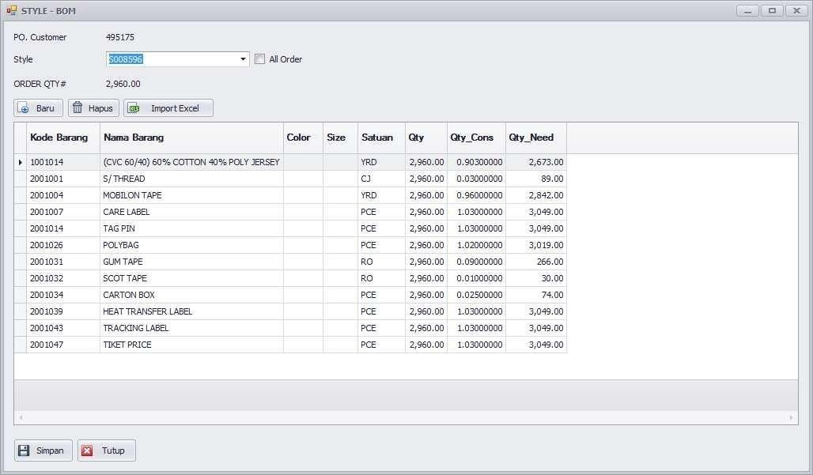<figcaption>
Contoh pengisian style consumption
</figcaption></figure>

Isi semua data yang ada di form **Style BOM** :

1. Pilih Style
2. Pilih Baru untuk mengisi BOM dari Style yang sudah dipilih&#x20;
3. Isi Quantity Consumption nya
4. Simpan dan Tutup

***

### 2. Masuk ke menu Purchasing

**Purchase Order**

<figure>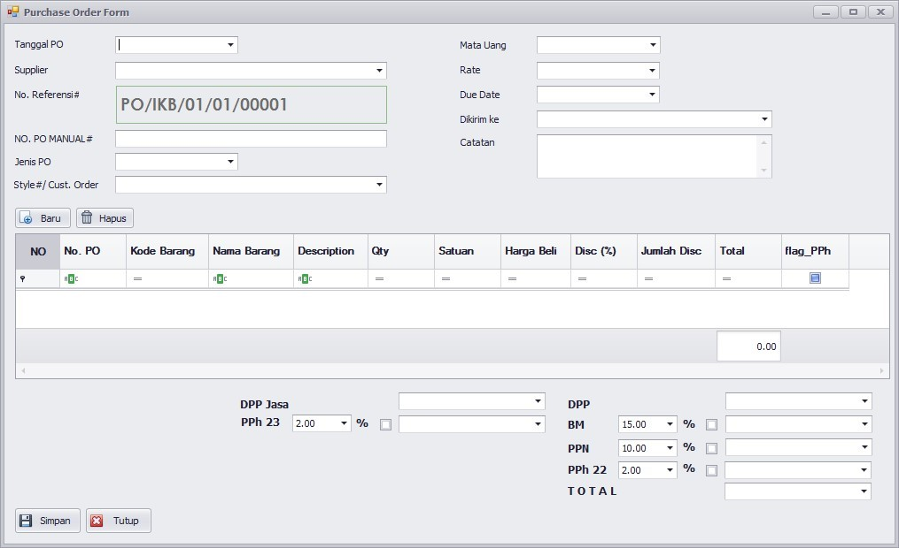<figcaption>
Tampilan form purchase order
</figcaption></figure>

Isi semua data yang ada di form **Purchase Order** :

1. Pilih Baru
2. Pilih Tanggal PO
3. Pilih Suplier
4. Isi No PO Manual&#x20;
5. Isi Jenis PO
6. Isi Style
7. Isi Mata Uang
8. Isi DueDate nya
9. Pilih Tujuan nya
10. Simpan dan Tutup

***

### 3. Masuk ke menu Warehouse

**Mutasi BB/BP IN**

<figure>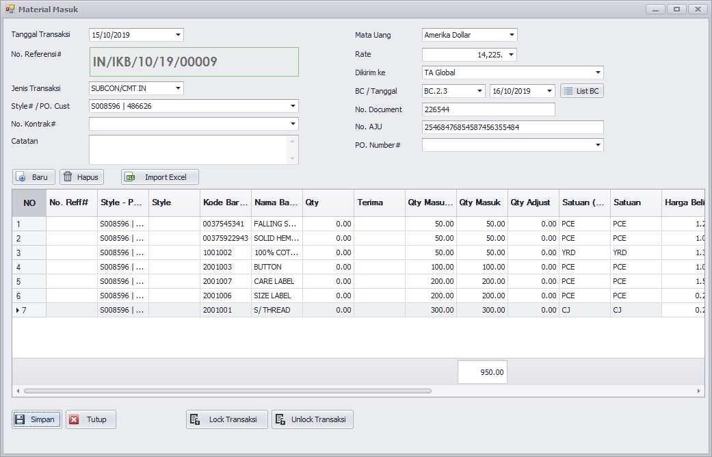<figcaption>
Contoh pengisian mutasi BB/BP IN
</figcaption></figure>

Isi semua data yang ada di form **Mutasi BB/BP IN** :

1. Pilih Baru
2. Pilih Tanggal Transaksi
3. Pilih Jenis Transaksi
4. Pilih Style/PO Customer&#x20;
5. Pilih Type Mata Uang
6. Isi Rate Mata uang
7. Pilih Gudang Penerimaan&#x20;
8. Isi BC dan Tanggal
9. Isi Document BC
10. Isi No AJU
11. Pilih Baru Isi Sesuai dengan Document&#x20;
12. Isi Quantity Masuk dan harga satuan&#x20;
13. Simpan dan Tutup

***

### 4. Masuk ke menu Produksi

**Material Request**

<figure>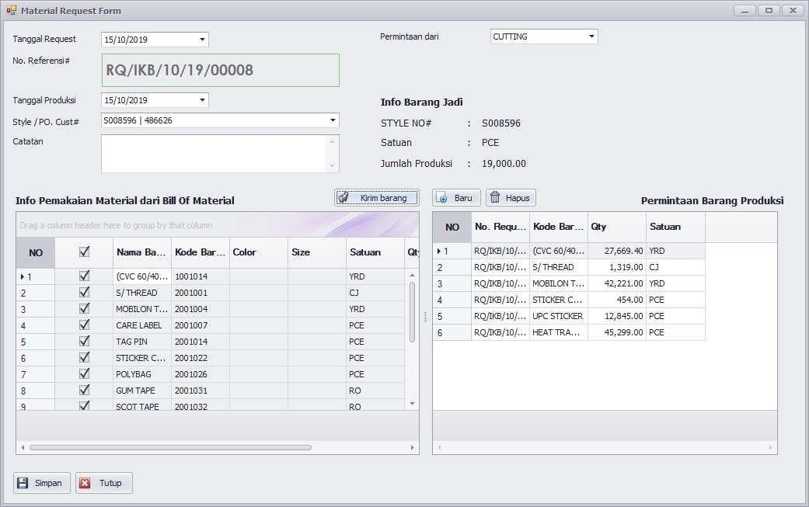<figcaption>
Contoh pengisian material request
</figcaption></figure>

Isi semua data yang ada di form **Material Request** :

1. Pilih Baru
2. Pilih Tanggal Request
3. Pilih Tanggal Produksi
4. Pilih Style/PO Customer
5. Pilih Permintaan dari
6. Pilih Bahan baku yang mau dikrim ke Produksi&#x20;
7. Simpan dan Tutup

***

### 5. Kembali ke menu Warehouse

**Mutasi BB/BP OUT**

<figure>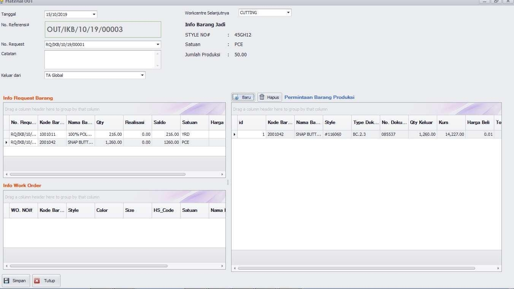<figcaption>
Contoh pengisian Mutasi BB/BP OUT
</figcaption></figure>

Isi semua data yang ada di form **Mutasi BB/BP OUT** :

1. Pilih Baru
2. Pilih Tanggal
3. Pilih No Request
4. Pilih Gudang yang akan mengeluarkan barang&#x20;
5. Pilih Workcentre Selanjutnya
6. Pilih baru di kolom form permintaan barang produksi
7. Pilih dan Ambil barang
8. Simpan dan Tutup

***

### 6. Kembali ke menu Produksi

**WIP Cutting Incoming**

<figure>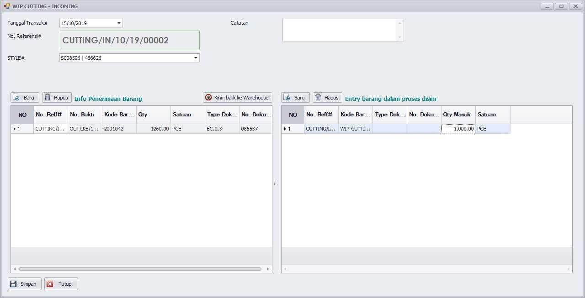<figcaption>
Contoh pengisian pada WIP Cutting Incoming
</figcaption></figure>

Isi semua data yang ada di form **WIP CUTTING** :

1. Pilih Baru
2. Pilih Tanggal Transaksi&#x20;
3. Pilih Style/Po Customer
4. Isi baru di Kolom Info Penerimaan barang dan Ambil data
5. Isi baru di Kolom Entry barang dalam proses
6. Simpan dan Tutup

**WIP Cutting Outgoing**

<figure>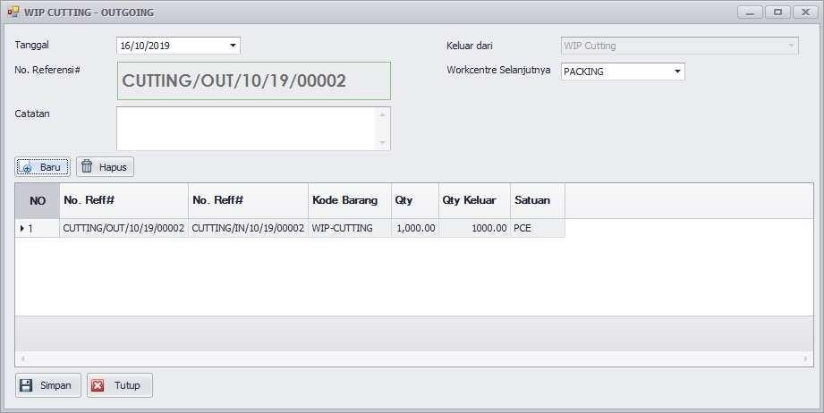<figcaption>
Contoh pengisian pada WIP Cutting Outgoing
</figcaption></figure>

Isi semua data yang ada di form **WIP CUTTING** :

1. Pilih Baru dan Ambil data
2. Pilih Tanggal Transaksi
3. Pilih Workcentre Selanjutnya&#x20;
4. Pilih Baru dan Isi data


Untuk proses dan cara kerja produksi keseluruhan **sama seperti cara Cutting In dan Out**.


**Hasil Produksi**

<figure>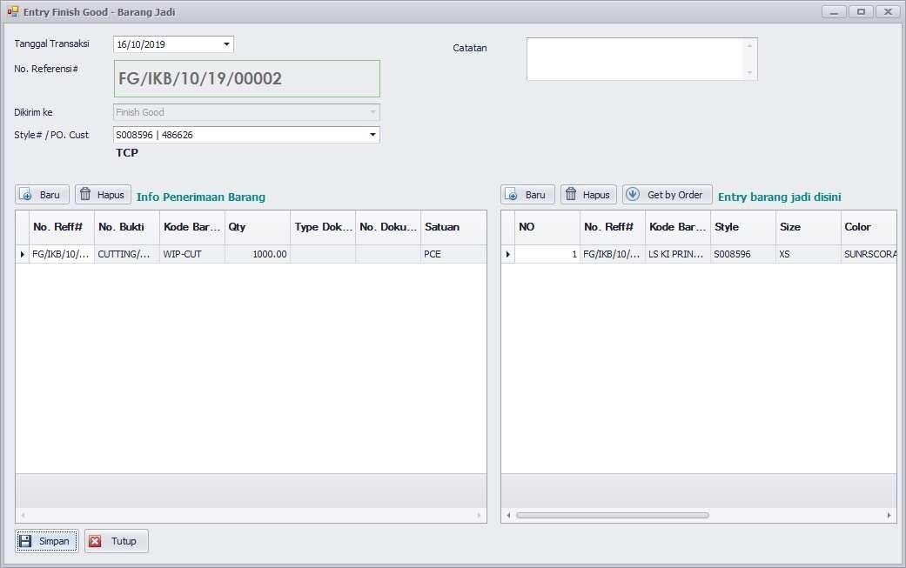<figcaption>
Contoh pengisian pada Hasil Produksi
</figcaption></figure>

Isi semua data yang ada di form **Barang Jadi** :

1. Pilih Baru
2. Pilih Tanggal Transaks
3. Pilih Style/PO Customer
4. Pilih Baru dan Ambil data di kolom **Info Penerimaan Barang**
5. Get by Order atau pilih Baru di kolom **Entry barang jadi**
6. Simpan dan Tutup

***

### 7. Kembali ke menu Warehouse

**Delivery Order (DO)**

<figure>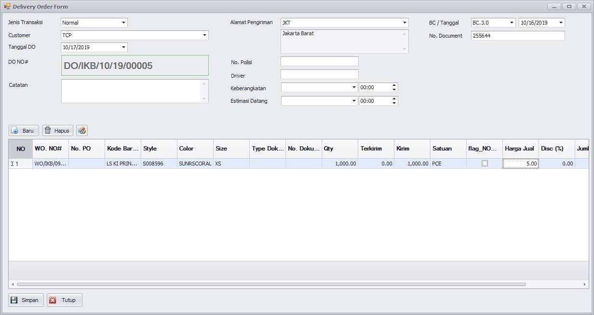<figcaption>
Contoh pengisian form Delivery Order (DO)
</figcaption></figure>

Isi semua data yang ada di form **Delivery Order (DO)** :

1. Pilih Baru
2. Pilih Jenis Transaksi&#x20;
3. Pilih Customer
4. &#x20;Pilih Tanggal DO
5. Pilih Alamat Pengiriman
6. Isi data BC dan Tanggalnya
7. Isi No Document BC
8. Pilih baru ambil data sesuai dengan Style dan No PO Customer
9. Simpan dan Tutup

***

### 8. Kembali ke menu Marketing

**Sales Invoice**

<figure>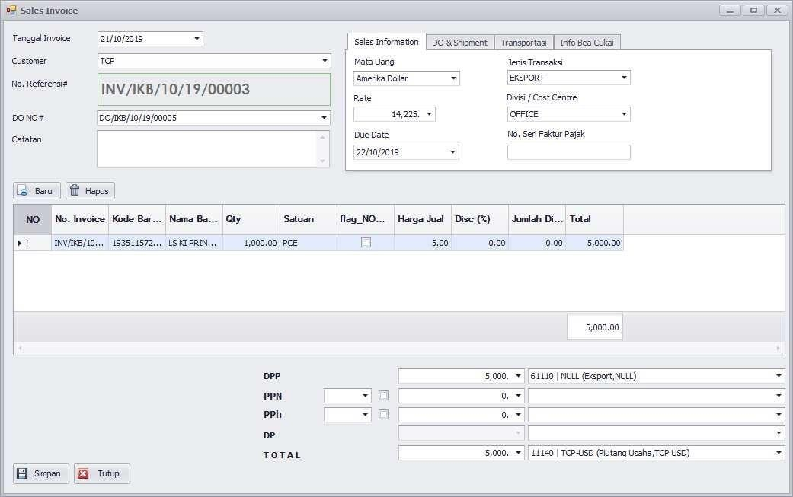<figcaption>
Contoh pengisian form Sales Invoice
</figcaption></figure>

Isi semua data yang ada di form **Sales Invoice** :

1. Pilih Baru
2. Pilih Tanggal Invoice m. Pilih Customer
3. Pilih No DO
4. &#x20;Isi Sales Informasi
5. Pilih baru ambil data sesuai dengan Style dan No PO Customer
6. Isi No Account ACC 61110 (Eksport) dan 11140 (Piutang Usaha)
7. Simpan dan Tutup
