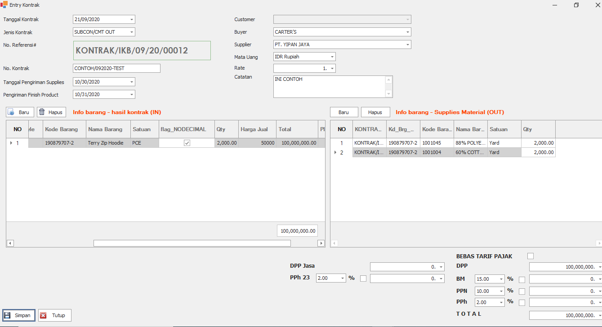

# 🔁 Alur Pengisian Subcon

## 1. Buat Kontrak Kerja untuk Kegiatan Subcon

Contoh Kontrak Subcon

1. Masuk ke Menu Marketing
2. Pilih Kontrak Subcon
3. Dan di Isi data Seperti dibawah ini.
4. Dan simpan + close

<figure><figcaption>
Contoh pengisian form kontrak subcon
</figcaption></figure>


Gambar diatas merupakan tampilan dari kontrak subcon, terdapat 2 form didalamnya Form sebelah Kiri diisi dengan hasil barang jadi yang akan di subcon, sedangkan Form sebelah kanan disi dengan Material bahan baku yang akan di subcon kan. Setelah kontrak sudah dibuat selanjutnya masuk ke menu Warehouse.


## 2. Buat Subcon&#x20;

1. Pilih menu warehouse
2. Pilih Subcon In/Out
3. Buat Baru dan Isi data Seperti dibawah ini
