# 📅 Pemeliharaan Data

Pengisian data master harus diisi secara teratur agar didapatkan hasil yang optimal. Adapun urutan pengisian data master adalah sebagai berikut :

1. [BARANG](pemeliharaan-data.md#menu-barang)
2. [GUDANG](pemeliharaan-data.md#menu-gudang)
3. [UNIT BARANG](pemeliharaan-data.md#menu-unit-barang)
4. [KATEGORI BARANG](pemeliharaan-data.md#menu-kategori-barang)
5. [LINE](pemeliharaan-data.md#menu-line-production)
6. COLOR
7. [SIZE](pemeliharaan-data.md#menu-size)
8. [BUYER](pemeliharaan-data.md#menu-buyer)
9. [DOC. BC](pemeliharaan-data.md#menu-dokumen-bc)
10. [PENGGUNA](pemeliharaan-data.md#menu-nama-pengguna)

### Tampilan Awal Pemeliharaan Data

Data ini digunakan untuk mengisi semua master data untuk aplikasi inventori

<figure>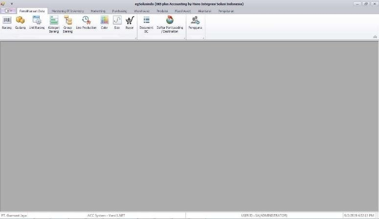<figcaption>
Tampilan Awal pada Pemeliharaan Data
</figcaption></figure>

***

### Menu Barang

Menu ini berfungsi untuk menambah, merubah dan menghapus data dari master barang.

<figure>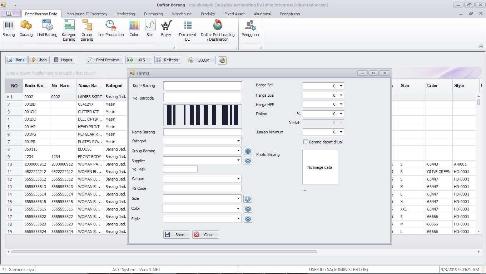<figcaption>
Tampilan Menu Barang pada Pemeliharaan Data
</figcaption></figure>

***

### Menu Gudang

Menu ini berfungsi untuk menambah, merubah dan menghapus data dari master gudang.

<figure>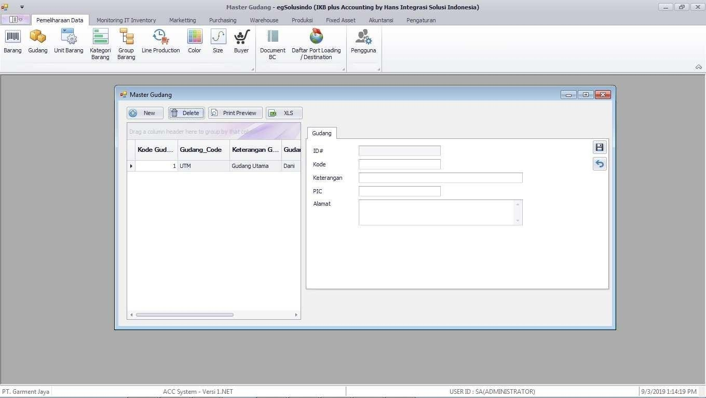<figcaption>
Tampilan Menu Gudang pada Pemeliharaan Data
</figcaption></figure>

***

### Menu Unit Barang

Menu ini berfungsi untuk menambah, merubah dan menghapus data dari master unit barang.

<figure>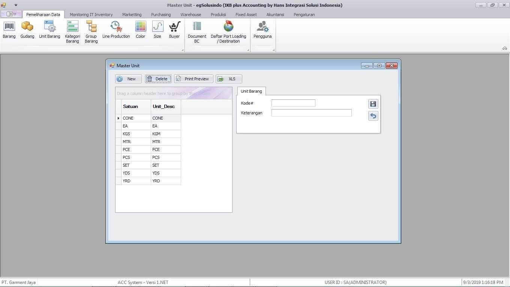<figcaption>
Tampilan Menu Unit Barang pada Pemeliharaan Data
</figcaption></figure>

***

### Menu Kategori Barang

Menu ini berfungsi untuk menambah, merubah dan menghapus data dari master kategori barang.

<figure>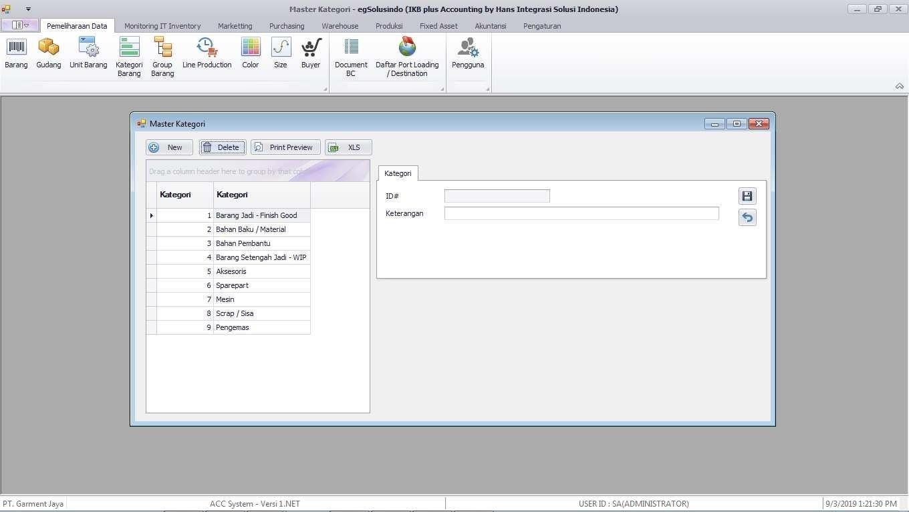<figcaption>
Tampilan Menu Kategori Barang pada Pemeliharaan Data
</figcaption></figure>

***

### Menu Group Barang

Menu ini berfungsi untuk menambah, merubah dan menghapus data master group barang.

<figure>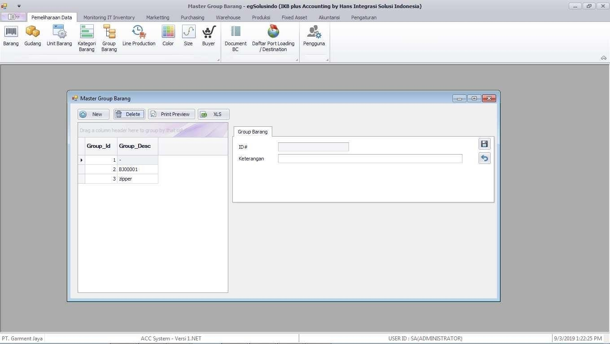<figcaption>
Tampilan Menu Group Barang pada Pemeliharaan Data
</figcaption></figure>

***

### Menu Line Production

Menu ini berfungsi untuk menambah, mengubah dan menghapus data master line production.

<figure>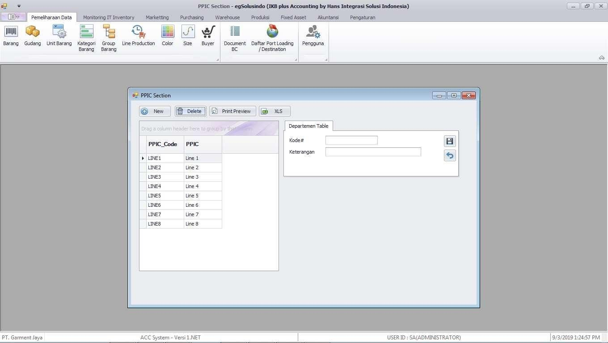<figcaption>
Tampilan Menu Line Production pada Pemeliharaan Data
</figcaption></figure>

***

### Menu Size

Menu ini berfungsi untuk menambah, merubah dan menghapus data master size.

<figure>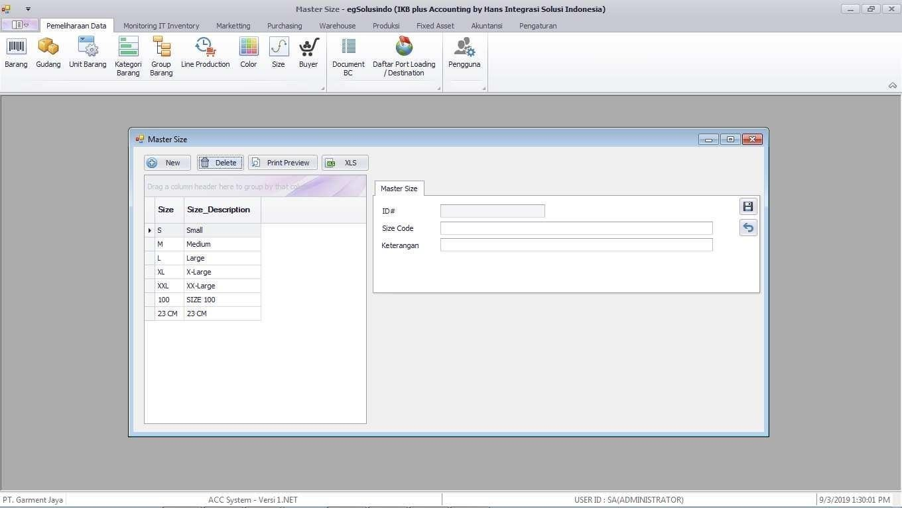<figcaption>
Tampilan Menu Size pada Pemeliharaan Data
</figcaption></figure>

***

### Menu Buyer

Menu ini berfungsi untuk menambah, merubah dan menghapus data master buyer.

<figure>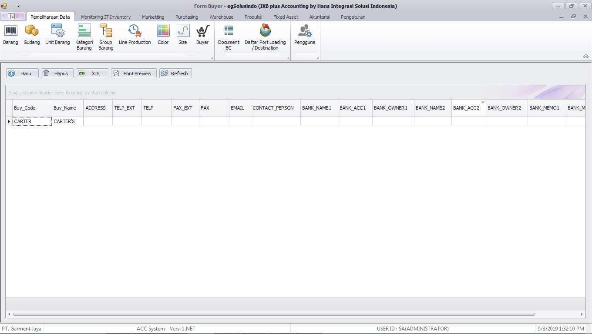<figcaption>
Tampilan Menu Buyer pada Pemeliharaan Data
</figcaption></figure>

***

### Menu Dokumen BC

Menu ini berfungsi untuk menambah, merubah dan menghapus data master document bc.

<figure>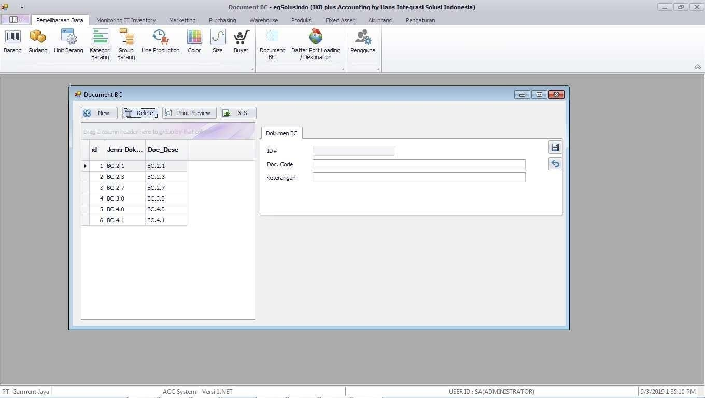<figcaption>
Tampilan Menu Dokumen BC pada Pemeliharaan Data
</figcaption></figure>

***

### Menu Daftar Port Loading

Menu ini berfungsi untuk menambah, merubah dan menghapus data master port loading.

<figure>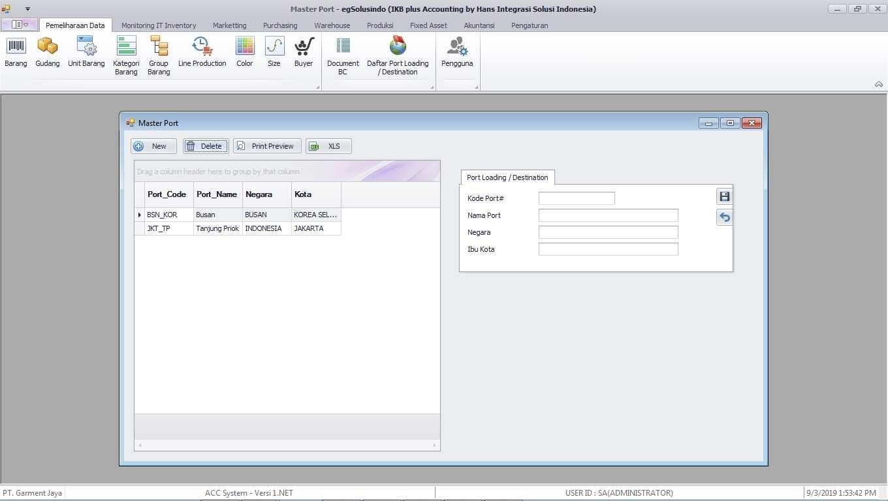<figcaption>
Tampilan Menu Port Loading pada Pemeliharaan Data
</figcaption></figure>

***

### Menu Nama Pengguna

Menu ini berfungsi untuk menambah, merubah dan menghapus master data nama pengguna.

<figure>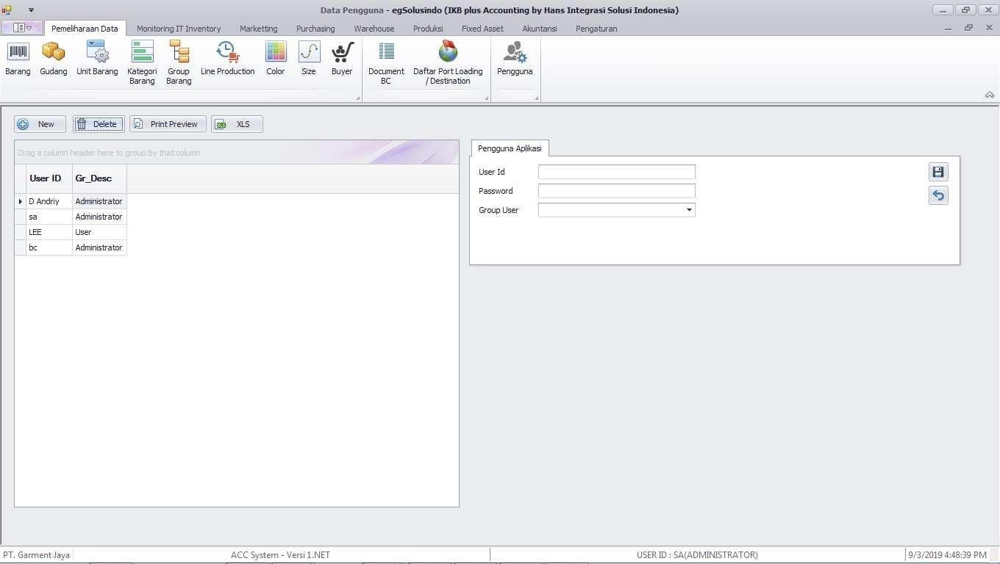<figcaption>
Tampilan Menu Nama Pengguna pada Pemeliharaan Data
</figcaption></figure>
