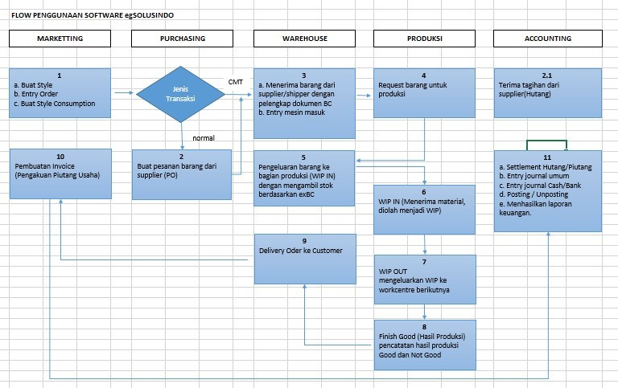

# 💻 Kebutuhan Sistem

## Spesifikasi

Sistem Aplikasi egIKB yang dikembangkan ini memiliki spesifikasi sebagai berikut:

1. Pengembangan dengan Visual Basic 6.0
2. Multi   User,   beberapa   operator/pemakai dapat menjalankan program secara bersamaan.
3. User Password, menjaga sekuritas pemakaian system.
4. Data  Protection  &  Automaticly  Backup,  menjaga  sekuritas  data melalui proteksi database dan backup data secara otomatis.
5. User Friendly, kemudahan penggunaan system.
6. User  Privilege, membatasi  operator mana saja yang berhak menjalankan menu tertentu dalam sistem.
7. Report   Generator, laporan   dapat dihasilkan sesuai dengan kebutuhan (selain Laporan standar)

***

## Konfigurasi

* Windows NT 4 / 2008 server pada server
* Windows 7/10 Professional pada client
* Crystal Report 11 atau yang terbaru
* Microsoft SQL-Server 2008 atau yang terbaru

***

## Diagram Flow System

<figure><figcaption>
Diagram Flow System dari aplikasi egIKB
</figcaption></figure>
