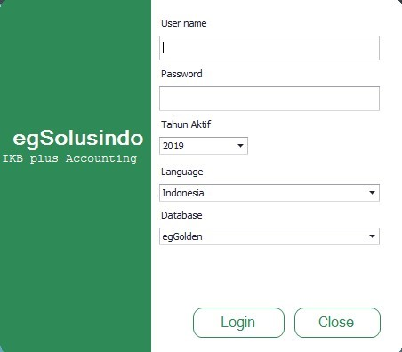

# 👨‍🏫 Petunjuk Umum Penggunaan Aplikasi

## Penggunaan Tombol

| Tombol    | Fungsi                                      |
| --------- | ------------------------------------------- |
| New       | Menginput/membuat data baru                 |
| Delete    | Menghapus data                              |
| Open      | Melihat data yang telah diinput             |
| Print     | Mencetak data                               |
| Pencarian | Melakukan pencarian data yang telah diinput |
| Refresh   | Sebagai tombol refresh data                 |
| Tanggal   | Menunjukkan tanggalan                       |

## Cara Menjalankan Sistem Aplikasi

Program aplikasi egIKB dapat dijalankan dengan menekan tombol pada icon egIKB. Tempatkan shortcut aplikasi pada desktop anda sehingga memudahkan untuk menemukan aplikasi ini. Jika icon tersebut sudah diklik, maka akan tampil logo aplikasi diikuti dengan pengisian aplikasi login.

<figure><figcaption>
Tampilan login pada aplikasi egIKB
</figcaption></figure>

Pada tahap ini, user diminta  untuk mengisi  nama dan password.  Hal ini berguna  dalam  menentukan  level keamanan  yang dimiliki  oleh user/pengguna.

Cara mengisi kolom ini:

Perusahaan    : Isi dengan Nama perusahaan

User ID             : Isi dengan Nomor ID **sa** untuk Sistem Administrator

Password        : Isi Password dengan huruf **sa**


Data diatas hanya merupakan contoh dan bukan data yang sebenarnya.

